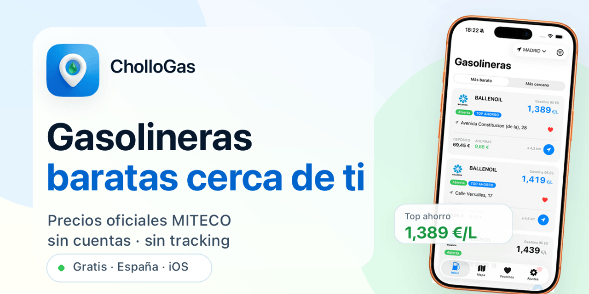
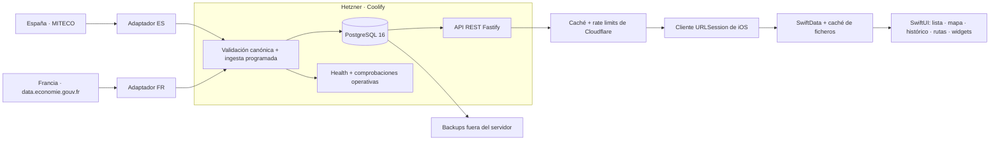
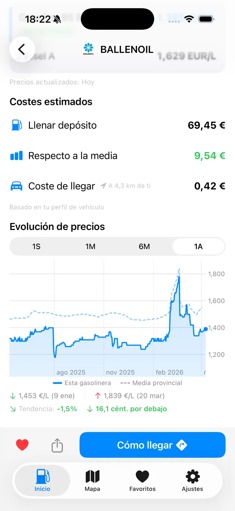
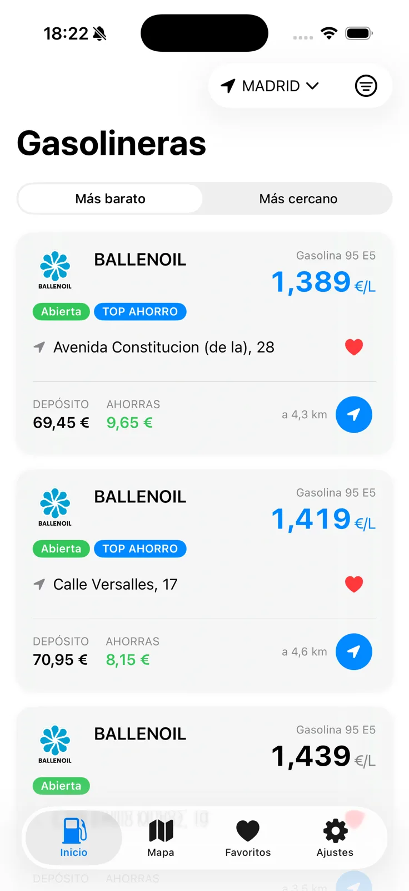
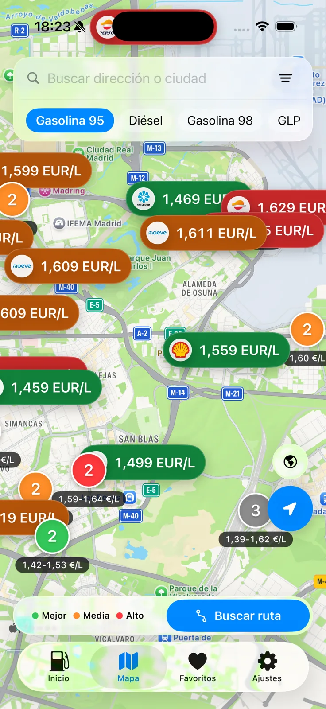
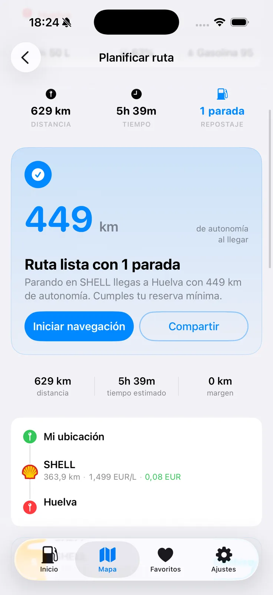

# CholloGas — construir y operar una plataforma de combustible offline-first en España y Francia, en solitario

**[English](README.md)** · **[Producto](https://chollogas.ogamlabs.com)** ·
**[App Store](https://apps.apple.com/es/app/chollogas-gasolineras-baratas/id6773014516)** ·
**[Catálogo de países](https://api.ogamlabs.com/v2/metadata/countries)** ·
**[Licencia](LICENSE.md)** ·
**[Seguridad](SECURITY.md)** · **[Procedencia de assets](ASSET_PROVENANCE.md)**

CholloGas es una app iOS para comparar precios oficiales de carburantes en
España y Francia. He construido y opero el producto entero: la app SwiftUI, su
capa de datos local, la API TypeScript, el modelo PostgreSQL, la ingesta por
país, el despliegue, las copias de seguridad y la monitorización.

Este repositorio es el caso de estudio técnico, no el código del producto. La
app, el backend y la configuración de infraestructura siguen siendo privados.
Lo público aquí es la forma del sistema, las decisiones, sus costes y capturas
reales del producto.

> **Estado:** CholloGas está disponible en la App Store con soporte para España
> y Francia. Las cifras siguientes describen el alcance del producto, no
> descargas ni ingresos.

[Abrir la vista general original de 1200×630](assets/product-overview.png)

| Alcance en producción | Valor |
| --- | ---: |
| Países | **2 — España y Francia** |
| Registros de estaciones en fuentes oficiales | **+21.000** |
| Catálogo de carburantes de origen | **13 ES · 6 FR** |
| Actualización de precios | **Cada 6 horas** |
| Idiomas en la App Store | **5** |

_Snapshot de cobertura comprobado el 3 de agosto de 2026: 11.489 registros en
el [catálogo español de MITECO](https://datos.gob.es/es/catalogo/e05068001-instalaciones-de-suministro-de-combustibles-a-vehiculos-con-venta-publica)
y 9.803 puntos de venta abiertos en el
[dataset del Gobierno francés](https://data.economie.gouv.fr/explore/dataset/prix-des-carburants-en-france-flux-instantane-v2/).
Estas cantidades de origen cambian y no son métricas de uso._

### Qué demuestra este proyecto

- **Responsabilidad de producto:** una app publicada que he construido y opero
  de extremo a extremo, no una demo aislada.
- **Profundidad iOS:** datos offline-first, ubicación, rutas, widgets, StoreKit
  y concurrencia estricta de Swift detrás de una experiencia coherente.
- **Criterio de backend y datos:** dos contratos públicos normalizados en un
  modelo tipado, ingesta idempotente, histórico significativo y decisiones
  geográficas de producto.
- **Responsabilidad en producción:** contenedores, política de edge,
  monitorización, backups y restauración sobre infraestructura que sigo
  operando.

---

## 1. El problema real

España publica precios oficiales mediante MITECO; Francia mantiene su propio
feed abierto `Prix des carburants`. Eso resuelve la procedencia, pero no
construye un producto.

Los proveedores no coinciden en identificadores, geografía, campos opcionales,
timestamps ni catálogos de carburantes. España se organiza por provincias y
trece tipos de origen; Francia, por departamentos y seis. Antes de la validación
del producto, sus feeds públicos sumaban 21.292 registros de estación en el
snapshot del 3 de agosto de 2026. Una app transfronteriza útil todavía debe
responder preguntas distintas:

- ¿Qué estaciones son baratas **para este combustible y este vehículo**?
- ¿El precio es realmente barato o solo menor que el de la estación de al lado?
- ¿Puede abrirse la app con mala cobertura y seguir mostrando algo útil?
- ¿Compensa desviarse o se gasta en llegar más de lo que se ahorra?
- ¿Dónde conviene repostar en una ruta larga sin bajar del margen de seguridad?

Así, una lista de precios aparentemente pequeña terminó siendo un producto que
combina ingesta, almacenamiento, caché, consultas geográficas, decisiones de
ruta, persistencia local, widgets, StoreKit y operación diaria.

## 2. Un producto, no una colección de demos

Soy responsable de todas las capas que deben ponerse de acuerdo:

- **iOS:** Swift 6, SwiftUI, Observation, concurrencia estricta, SwiftData,
  WidgetKit, App Intents y StoreKit 2.
- **Arquitectura de aplicación:** Clean Architecture con MVVM y navegación
  basada en Router; límites explícitos entre dominio, datos y features.
- **Backend:** Node.js, TypeScript ESM, Fastify, Zod, Drizzle ORM y PostgreSQL
  16.
- **Producción:** Docker sobre Hetzner, desplegado y operado mediante Coolify,
  con Cloudflare delante de la API pública.
- **Datos:** ingesta programada mediante adaptadores por país para MITECO y el
  feed del Gobierno francés, seeds idempotentes e histórico delta.
- **Operación:** health checks, reglas de caché y rate limit, notificaciones de
  despliegue, copias programadas y verificación de restauración.

Lo interesante no es que exista cada caja. Es que la semántica del producto se
mantenga consistente entre todas ellas.

## 3. Arquitectura de producción

La app iOS actual habla con la API del producto, no directamente con ninguno de
los feeds públicos. Así el cliente tiene un único contrato tipado, el edge puede
cachear lecturas públicas y las peculiaridades de cada país quedan encerradas
en la ingesta.

La API es pública deliberadamente para el alcance actual. CholloGas no necesita
una cuenta para mostrar estaciones o calcular una ruta, así que no añade un
login ni una base de identidades solo por convención.

## 4. Cuatro decisiones que dieron forma al sistema

### 4.1 Guardar cambios, no observaciones

Escribir cada estación y cada combustible en cada refresco de seis horas haría
crecer el histórico porque avanzó el reloj, incluso cuando el precio no cambió.

La ingesta mantiene por tanto dos hechos distintos:

- el último precio conocido, para lecturas actuales rápidas;
- una fila histórica únicamente cuando el precio cambia de verdad.

Esto mantiene el histórico proporcional a cambios reales de precio en lugar de
ciclos de consulta. También introduce un coste semántico: una fecha en la app
significa «este precio cambió por última vez entonces», no «lo comprobamos
entonces». La interfaz debe explicar esa diferencia en vez de esconderla.

  

### 4.2 Offline-first es un requisito de producto

Las decisiones de combustible ocurren en carretera, justo donde la conectividad
es menos predecible. La app sirve primero un estado local útil y refresca en
segundo plano. SwiftData almacena los modelos habituales de navegación, mientras
que los payloads históricos de mayor tamaño usan una caché de ficheros para no
forzar todos los datos a pasar por el mismo mecanismo de persistencia.

No existe un «modo offline» separado. Lista, mapa, detalle y favoritos comparten
el mismo contrato de repositorio; perder la red cambia la frescura, no la forma
del producto.

| Lista de estaciones | Mapa de precios |
| --- | --- |
|  |  |

### 4.3 Una estación más barata no siempre produce un viaje más barato

El menor precio del surtidor puede ser una mala recomendación si llegar hasta él
quema más combustible del que se ahorra. CholloGas combina precio, consumo del
vehículo, distancia y perfil del depósito para estimar tanto el coste de llenar
como el coste de llegar.

Las rutas largas añaden otra restricción: llegar con la reserva definida por el
usuario. El flujo busca paradas viables y explica el resultado en términos de
producto —distancia, tiempo, parada de repostaje y autonomía restante— en lugar
de enseñar una puntuación opaca.

  

### 4.4 La privacidad cambia la arquitectura

CholloGas no tiene login. La ubicación se utiliza en el dispositivo para
estaciones cercanas, rutas y alertas locales opcionales. Analytics no recibe la
ubicación exacta, direcciones completas de estaciones ni identificadores
personales.

El modelo actual de alertas también es local: refresco en segundo plano de iOS,
cambios significativos de ubicación, candidatos `CLMonitor` y notificaciones
locales. El backend no necesita saber quién conduce ni seguir continuamente por
dónde se mueve.

StoreKit sigue el mismo principio de producto. Pro es una compra única, no una
suscripción obligatoria.

## 5. Operar lo que construí

La API pública corre en contenedores sobre un servidor de Hetzner gestionado con
Coolify. Cloudflare aporta el edge público, caché y protección de rate limit. La
sincronización de precios es una tarea programada de producción y solo un camino
de despliegue se considera canónico.

El trabajo menos visible importa igual:

- las migraciones se separan de reescrituras de datos arriesgadas;
- la ingesta y los seeds históricos son idempotentes;
- las lecturas públicas se pueden cachear y los endpoints operativos no;
- los backups salen del servidor y restaurar se trata como una capacidad
  verificable;
- los fallos de despliegue, backup o tarea programada generan notificaciones;
- los contratos de app y API se ejercitan con tests unitarios, de integración y
  de interfaz antes de considerar terminado un trabajo de release.

Evito publicar cifras de fiabilidad decorativas que no pueda reproducir. La
prueba útil aquí es el diseño operativo y que sigo siendo responsable de él
después de publicar el código.

## 6. Dónde encaja el dataset de GitHub Releases

[`OgamLabs/MITECO-Historical-prices`](https://github.com/OgamLabs/MITECO-Historical-prices/releases)
es una utilidad pública que empaqueta un año de precios históricos por
provincia. Fue útil como fuente de bootstrap y sigue siendo una forma opcional
de inicializar rápidamente un entorno vacío.

**No es la arquitectura de producción.** La operación normal consulta cada
fuente oficial mediante su adaptador de país y sirve la app mediante la API de
CholloGas. El artefacto de Releases solo ayuda a inicializar histórico español;
no participa en la ingesta francesa. Dejar clara esa diferencia evita presentar
un artefacto de datos conveniente como si fuera el sistema que mantiene el
producto.

## 7. Lo que sigue siendo privado

Este caso de estudio excluye deliberadamente:

- código fuente de la app y del backend;
- credenciales, direcciones de hosts e identificadores de proveedores;
- contenido de la base de datos y runbooks operativos internos;
- material de firma, configuración de StoreKit y roadmap no publicado.

Las capturas son imágenes reales del producto. La arquitectura y las cifras se
limitan a hechos que pueden explicarse sin debilitar el sistema ni exponer
trabajo privado.

## 8. Lo que llevaría al siguiente producto

- **Definir la semántica antes que el copy.** «Último cambio» y «última
  comprobación» son hechos de producto distintos, no detalles de formato.
- **Diseñar la operación antes del despliegue.** Backups, restauración, health y
  avisos de fallo forman parte de la feature.
- **Usar la privacidad como restricción simplificadora.** No tener cuentas y
  mantener alertas locales elimina categorías enteras de almacenamiento,
  seguridad y cumplimiento.
- **Medir la decisión completa.** Un precio bajo sin coste de desplazamiento ni
  contexto del vehículo aún puede ser una mala recomendación.

---

### Sobre este repositorio

CholloGas es un producto de **OgamLabs**. Este repositorio contiene únicamente
un caso de estudio e imágenes del producto; no es una edición open source de la
aplicación.

[Licencia de contenido y código](LICENSE.md) · [Avisos de seguridad](SECURITY.md)

Texto e imágenes © 2026 Óscar Cantón / OgamLabs. Por favor, no reutilices el
material gráfico del producto.
