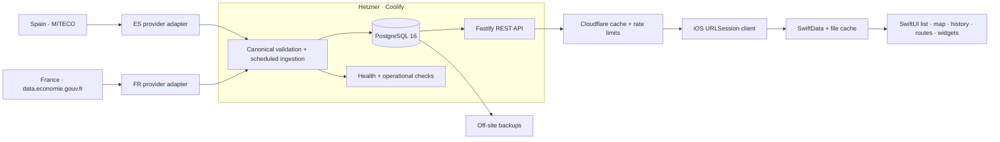
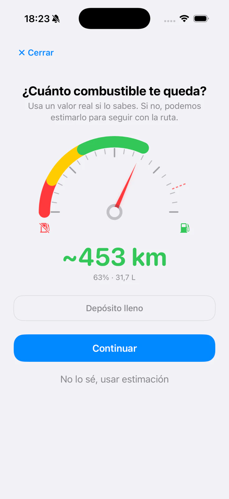
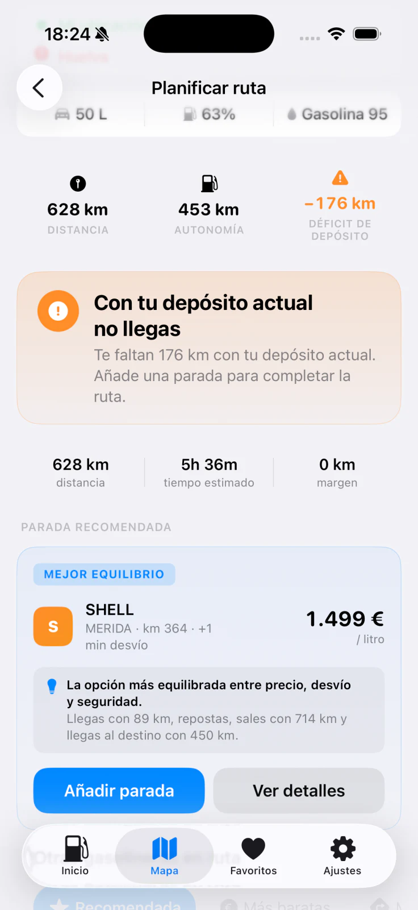

# CholloGas — shipping an offline-first fuel platform across Spain and France, solo

**[Español](README.es.md)** · **[Product](https://chollogas.ogamlabs.com)** ·
**[App Store](https://apps.apple.com/es/app/chollogas-gasolineras-baratas/id6773014516)** ·
**[Live country catalog](https://api.ogamlabs.com/v2/metadata/countries)** ·
**[License](LICENSE.md)** ·
**[Security](SECURITY.md)** · **[Asset provenance](ASSET_PROVENANCE.md)**

CholloGas is an iOS app for comparing official fuel prices across Spain and
France. I built and operate the whole product: the SwiftUI app, its local data
layer, the TypeScript API, the PostgreSQL model, country-specific ingestion,
deployment, backups and monitoring.

This repository is the engineering case study, not the product source. The app,
backend and infrastructure configuration remain private. What is public here is
the system shape, the decisions, the trade-offs and real product captures.

> **Status:** CholloGas is live on the App Store with Spain and France support.
> The figures below describe product scope, not downloads or revenue.

[Open the uncropped 1200×630 product overview](assets/product-overview.png)

_The hero combines an authentic Spanish-language product capture with the
current Spain-and-France scope. Product pixels were not translated,
reconstructed or regenerated._

| Production scope | Value |
| --- | ---: |
| Countries | **2 — Spain and France** |
| Official-source station records | **21,000+** |
| Source fuel catalog | **13 ES · 6 FR** |
| Production price refresh | **Every 6 hours** |
| App Store locales | **5** |

_Coverage snapshot retrieved on 3 August 2026 at 09:13 CEST:
11,492 records in the
[Spanish MITECO catalog](https://datos.gob.es/es/catalogo/e05068001-instalaciones-de-suministro-de-combustibles-a-vehiculos-con-venta-publica)
and 9,803 open-sale points in the
[French government dataset](https://data.economie.gouv.fr/explore/dataset/prix-des-carburants-en-france-flux-instantane-v2/).
Those upstream counts change and are not usage metrics._

### What this demonstrates

- **Product ownership:** a live App Store product built and operated end to end,
  not an isolated sample project.
- **iOS depth:** offline-first data, location, routes, widgets, StoreKit and
  strict Swift concurrency behind one coherent user experience.
- **Backend and data judgement:** two public provider contracts normalized into
  one typed model, idempotent ingestion, meaningful price history and
  geospatial product decisions.
- **Production responsibility:** containers, edge policy, monitoring, backups
  and restore planning on infrastructure I continue to operate.

---

## 1. The real problem

Spain publishes official fuel prices through MITECO; France publishes its own
open `Prix des carburants` feed. That solves provenance, but not the product.

The providers disagree on identifiers, geography, optional fields, timestamps
and fuel catalogs. Spain is organized around provinces and thirteen source fuel
types; France uses departments and six. Before product-side validation, their
public feeds exposed 21,295 station records in the 3 August 2026, 09:13 CEST
snapshot. A useful cross-border mobile product still has to answer different
questions:

- Which stations are cheap **for this fuel and this vehicle**?
- Is a price genuinely cheap, or only lower than the station next door?
- Can the user open the app with poor coverage and still see useful data?
- Is a detour worth the fuel it costs?
- Where should a driver refuel on a long route without dropping below their
  safety margin?

That turned a small-looking price list into a product spanning ingestion,
storage, caching, geospatial queries, route decisions, local persistence,
widgets, StoreKit and day-two operations.

## 2. One product, not a set of demos

I own every layer that has to agree for CholloGas to work:

- **iOS:** Swift 6, SwiftUI, Observation, strict concurrency, SwiftData,
  WidgetKit, App Intents and StoreKit 2.
- **Application architecture:** Clean Architecture with MVVM and Router-style
  navigation; explicit domain, data and feature boundaries.
- **Backend:** Node.js, TypeScript ESM, Fastify, Zod, Drizzle ORM and PostgreSQL
  16.
- **Production:** Docker on Hetzner, deployed and operated through Coolify,
  with Cloudflare in front of the public API.
- **Data:** scheduled ingestion through country-specific adapters for MITECO and
  the French government feed, idempotent seeds and delta-based price history.
- **Operations:** health checks, cache and rate-limit rules, deployment
  notifications, scheduled backups and restore verification.

The interesting part is not that each box exists. It is that product semantics
stay consistent across all of them.

## 3. Production architecture

The current iOS app talks to the product API, not directly to either government
feed. That gives the client one typed contract, allows the edge to cache public
reads and keeps country-specific quirks inside the ingestion layer.

The API is intentionally public for the current product scope. CholloGas does
not need an account to show stations or calculate a route, so there is no login
ceremony and no identity database added merely for convention.

## 4. Four decisions that shaped the system

### 4.1 Store changes, not observations

Writing every station and every fuel on every six-hour refresh would make the
history grow because the clock moved, even when the price did not.

The ingestion job therefore maintains two different facts:

- the latest known price for fast current reads;
- a historical row only when the price actually changes.

This keeps history proportional to real price changes instead of polling
cycles. It also creates a semantic cost: a date in the app means “this price
last changed then”, not “we last checked then”. The UI has to explain that
distinction instead of hiding it.

  

### 4.2 Offline-first is a product requirement

Fuel decisions happen on the road, exactly where connectivity is least
predictable. The app serves useful cached state first and refreshes in the
background. SwiftData stores product models for normal browsing, while larger
historical payloads use a file cache to avoid forcing every data shape through
the same persistence mechanism.

This is not “offline mode” as a separate feature. The list, map, details and
favourites all share the same repository contract, so losing the network
changes freshness, not the structure of the product.

| Station list | Price map |
| --- | --- |
|  |  |

### 4.3 A cheaper station is not always a cheaper trip

The lowest pump price can be a bad recommendation if reaching it burns more
fuel than it saves. CholloGas combines station price, vehicle consumption,
distance and tank profile to estimate both fill cost and travel cost.

Long routes add another constraint: arrive with a user-defined reserve. The
route flow searches for viable stops and explains the result in product terms
— distance, time, refuelling stop and remaining range — rather than exposing an
opaque score.

The decision is intentionally progressive: quantify the vehicle's usable range,
make any deficit explicit, then recommend a viable stop and explain why it is a
good balance of price, detour and safety.

| 1. Capture actual range | 2. Explain the deficit | 3. Confirm a viable stop |
| --- | --- | --- |
|  |  |  |

### 4.4 Privacy changes the architecture

CholloGas has no login and no advertising or cross-app tracking. Nearby
searches send coordinates to the product API because geospatial filtering runs
server-side; the request is unauthenticated. Exact coordinates, full addresses,
station IDs and personal identifiers are not included in TelemetryDeck events,
which are limited to product actions and coarse context such as province, fuel
type and active-filter count.

Optional alerts remain local: iOS background refresh, significant location
changes, `CLMonitor` candidates and local notifications. There is no identity
account or continuous movement feed sent to the backend.

StoreKit follows the same product principle. Pro is a one-time purchase, not a
mandatory subscription.

## 5. Operating what I built

The public API runs in containers on a Hetzner server managed through Coolify.
Cloudflare provides the public edge, caching and rate-limit protection. Price
sync is a scheduled production task and only one successful deployment path is
treated as canonical.

The less visible work matters just as much:

- database migrations are separated from risky data rewrites;
- ingestion and historical seeds are idempotent;
- public reads remain cacheable while operational endpoints bypass cache;
- backups leave the server and restore is treated as a testable capability;
- deployment, backup and scheduled-task failures produce notifications;
- app and API contracts are exercised with automated unit, integration and UI
  tests before release work is considered complete.

I avoid publishing vanity reliability numbers I cannot reproduce. The useful
proof here is the operational design and the fact that I remain responsible for
it after the code ships.

## 6. Where the GitHub releases dataset fits

[`OgamLabs/MITECO-Historical-prices`](https://github.com/OgamLabs/MITECO-Historical-prices/releases)
is a public utility that packages a year of historical prices by province. It
was useful as a bootstrap source and remains an optional way to seed an empty
environment quickly.

It is **not the production architecture**. Normal operation fetches each
official source through its country adapter and serves the app through the
CholloGas API. The release artifact only bootstraps Spanish historical data; it
is not involved in French ingestion. Keeping that distinction explicit avoids
presenting a convenient data artifact as if it were the system that runs the
product.

## 7. What remains private

This case study deliberately excludes:

- app and backend source code;
- production credentials, host addresses and provider identifiers;
- database contents and internal operational runbooks;
- signing material, StoreKit configuration and unpublished roadmap work.

The screenshots are real product captures. The architecture and numbers are
limited to facts that can be described without weakening the system or exposing
private product work.

## 8. What I would carry into the next product

- **Define data semantics before UI copy.** “Last changed” and “last checked”
  are different product facts, not formatter details.
- **Design for operation before deployment.** Backups, restore, health and
  failure notifications are part of the feature.
- **Use privacy as a simplifying constraint.** No account and local alerts
  remove entire classes of storage, security and compliance work.
- **Measure the whole decision.** A cheap price without travel cost or vehicle
  context can still be the wrong recommendation.

---

### About this repository

CholloGas is a product of **OgamLabs**. This repository contains a case study
and product imagery only; it is not an open-source edition of the application.

  

[Content and code licence](LICENSE.md) · [Security reporting](SECURITY.md)

Text and images © 2026 Óscar Cantón / OgamLabs. Please do not reuse the product
artwork.
